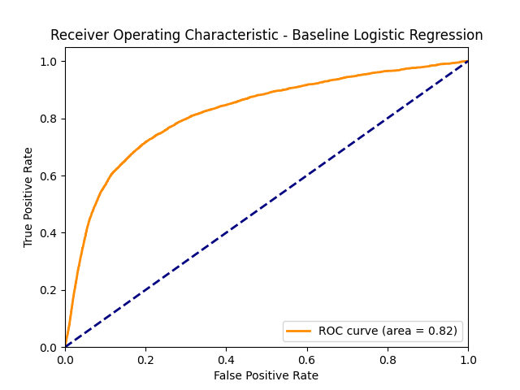
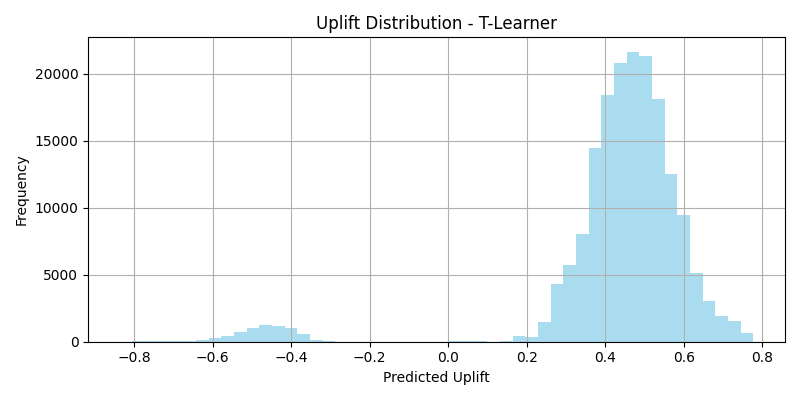
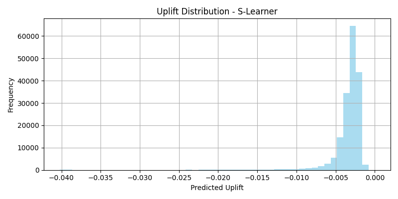
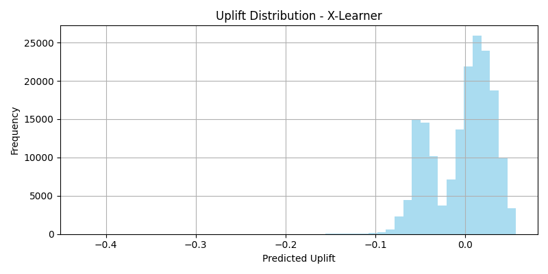

# A-B-test-analyzer

This project provides an advanced framework for analyzing A/B test results by moving beyond simple overall metrics and employing uplift modeling to identify specific user subgroups that are positively impacted by a new treatment. It also includes tools for Bayesian A/B testing and Multi-Armed Bandit optimization to maximize business value by targeting the right users and continuously improving campaign performance.

## 🚀 Key Features
- Overall Lift Analysis: Calculates the standard A/B test metrics, including the overall absolute and relative lift, to provide a baseline for comparison.
- Multiple Uplift Models: Implements and compares three different machine learning models—T-Learner, S-Learner, and X-Learner—to predict the incremental impact of the treatment on individual users.
- Bayesian A/B Test: Provides a modern Bayesian approach to A/B testing, allowing for more intuitive insights like the probability that a new treatment is better than the control.
- Multi-Armed Bandit Algorithms: Includes implementations of Thompson Sampling and Epsilon-Greedy algorithms for continuously optimizing ad campaigns in production.
- Subgroup Identification: Identifies the most responsive user segments to determine which group will benefit most from the treatment.
- Business Impact Simulation: Projects the financial impact of a targeted rollout versus a full rollout, translating data science insights into clear business value.

## 📊 Dataset

This project uses a dataset from a simple marketing A/B testing campaign. Marketing companies often run these tests to determine which campaign versions are most effective. This process involves showing two or more versions of a variable (e.g., a web page or ad) to different segments of people to find the version with the maximum impact.

## 📚 Data Dictionary
- Index: Row index.
- user id: User ID (unique).
- test group: Indicates the user's group. "ad" for the experimental group and "psa" for the control group.
- converted: A boolean value (True or False) indicating if a person bought the product.
- total ads: The total number of ads seen by a person.
- most ads day: The day of the week on which the person saw the highest number of ads.
- most ads hour: The hour of the day on which the person saw the highest number of ads.

## 🛠️ Quick Start
### Prerequisites
- Python 3.8+ 

### Clone the Repository
- git clone https://github.com/Nahian1504/A-B-test-analyzer.git
- cd A-B-test-analyzer

### Install Dependencies
- Navigate to the project root and install the required libraries (pip install reuirements.txt).

### Run the Analysis
- Execute the main script to run the uplift models and generate the summary report.

## 📊 Results
- Overall Average Treatment Effect (ATE): The new treatment had a negative effect on the overall user base, with an overall relative lift of -29.27%.
- Best-Performing Uplift Model: The S-Learner model was most effective, identifying a subgroup with a positive relative uplift of 37.11%.
- Net Savings: By implementing a targeted approach for this subgroup, the projected net savings are over $9.17 million per year.
- 
- 
- 
- 
- 

## 📝 License
This project is licensed under the MIT License - see the LICENSE file for details.

## 📞 Contact
- For any questions or suggestions, feel free to reach out:

    Email: nahian.tasnim@slu.edu
